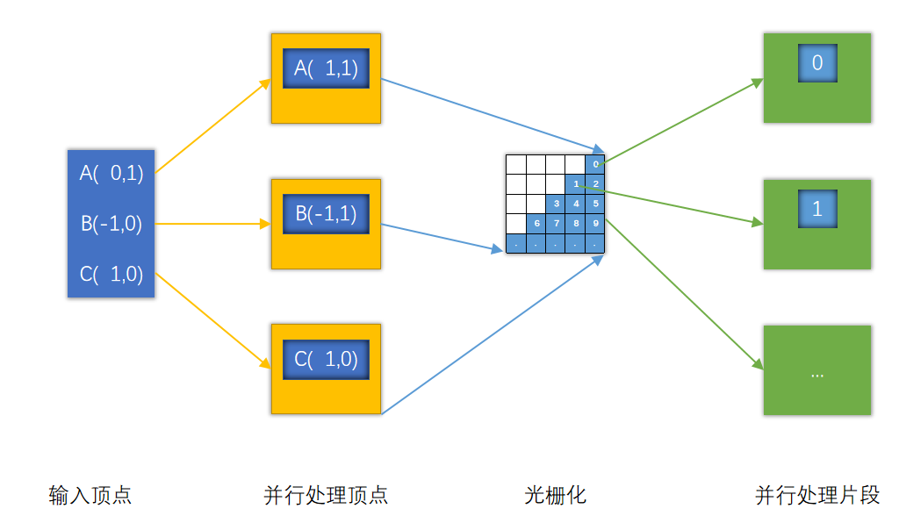

# 图形渲染管线（Graphic Rendering Pipeline）

相信你肯定看过一些关于渲染管线的文章，那么你是否知道渲染管线是什么呢？如果是，恭喜你掌握了现代图形渲染的核心，如果不是，你可以简单阅读一下这篇文章，它能消除你的一些模糊概念。

## 追根溯源

作为一名程序开发者，你可能已经使用过一些GUI框架，这些框架大多会提供一套使用CPU进行绘图的API来绘制2D图形，这类API（下方统称为普通API】）一般都会提供类似下面这样的绘图函数：

```
画线函数：提供两个端点的坐标来进行绘制
画圆函数：提供圆形坐标和半径来进行绘制
画矩形函数：提供长宽以及其中一个规定点的坐标（一般是左上角，或矩形中心）来进行绘制
画多边形函数：通过一系列的顶点来绘制多边形
画图函数：提供一张外部图像和绘制的矩形区域
....
```

不难看出，假如我们需要创建某个图形，只需提供较少的图形特征（比如线的两个端点，圆的中心和半径等）给上述函数，就能快速创建对应的图形。

这些函数非常好用，但却需要保证——参数能够精准的描述出图形的特征，即参数对应的图形是唯一的。

因此它们只能用来绘制一些简单的图形，像线条，圆，矩形这样的，试想我们如果想要实现一个画猫函数，那应该提供怎样的参数才能保证画出的猫是唯一的呢？

很显然，猫的特征太多了，想要通过特征来描述猫的形状，是一件很困难的事情。

那么应该怎样才能绘制一个猫出来呢？

仔细思考，计算机中的任何图形都是由点、线、面构成，它并非是真正的实体。而猫，不过是一个由很多多边形组合到一起的图形而已，而多边形又可以由三角形组合而成。所以要画猫的话，只需要使用足够的三角形拼出一个猫即可。

咦，我们是不是只使用三角形，就能拼出任何复杂的图形？

很显然，是的。采用这样的思想，计算机渲染的性能瓶颈也从如何高效绘制某个物体，变成了如何高效绘制 **大量** 的 **三角形**。

这时候有些小伙伴可能就会问啦：这有什么难的，三个顶点就完事了，画个三角形难道还能玩出花来？

### 高效处理三角形

#### 顶点处理

当我们在绘制一些静态物体的时候，并不需要对顶点进行处理，但如果我们想让绘制的物体能够动起来，在三角形层面，相当于对三角形进行平移，旋转，缩放，透视等操作，所以需要我们对这些操作提供支持：

> 平移大家应该都知道怎么实现，只需增减对应坐标即可，实现渲染有的小伙伴可能会利用三角函数，而缩放、透视等其他操作，可能会专门写算法来实现。

了解线性代数的同学都清楚，上面的操作其实都可以使用向量+矩阵的形式来处理，而渲染管线中也正是使用的这种方式，那为什么要使用这种方式呢？

> 这是因为使用向量+矩阵可以很好地归纳顶点的各种处理操作，以此为基础，计算机在硬件上提供了专门用于加速向量计算的微型处理器，这就涉及到一个新概念——SIMD（Single Instruction Multiple Data，单指令流多数据流）

正常情况下， 计算二维向量A（1，1）和B（1，1）的和，对于每个元素，都得调用+指令，即（1+1，1+1），而SIMD在硬件层面允许（1，1）+（1，1），这个操作看起来并不起眼，但在密集型计算时，它的提升是巨大的。

> 关于SIMD，强烈推荐看下[这篇博客]( https://www.cnblogs.com/ncdxlxk/p/10165553.html)，有多个篇章讲解 GPU的架构 

这里我们需要注意的是：使用SIMD需要保证处理的数据是16字节对齐，之后的代码中会有一些隐式的对齐，大多与它有关。

#### 绘制

计算机本身只负责处理逻辑与数据（内存），我们想要绘制一个三角形，就得编写相应的逻辑来填充计算机所能理解的数据。

我们可以将屏幕看成一个二维数组，屏幕上的每个像素的颜色就存储在这个二维数组上，如果想让屏幕上显示出一个三角形，那么就得在对应的元素上填入三角形的颜色数据，可以简单用如下的代码描述这个过程：

```C++
for(int x = 0; x < screen.width; x++){
	for(int y = 0; y < screen.height; y++){
        if(triangle.contains(x,y)){			//判断当前的点是否包含在绘制三角形的区域里
           	screen[x][y] = trangle.color;	//填充颜色
        }
    }
}
```

这个过程有一个专业的名词——光栅化（ Rasterization）。经光栅化之后，原先的三个顶点 变成了 多个离散的片段数据，其过程看起来像是下面这样：


> 从上图可以发现一个问题：现实中三角形内部可能由无数个点，但电脑屏幕上的像素是有限的，因此在光栅化过程中会丢失一些精度，产生所谓的“锯齿“。

关于光栅化的算法有很多，但由于这部分这并不是我们研究的重点，有兴趣的同学可以研究一下。

### 并行

上面我们简述了计算机如何高效的处理单个的三角形，下面我们思考一个问题：

- 假如写一个字需要1s，写1000个字需要多少秒？

> 如果你想的是1000s，那你就太年轻了，像我原来上小学收假前一天补作业，那都是一只手捏三支笔，我本来以为自己就够逆天了，开学后更是听闻有些高人可以做到左右手开工，自愧不如啊。
>
> 仔细一想：只要我们同时写多个字，时间就能快很多，夸张点，如果我们能同时写1000个字，那就只需要短短的1s，我当时要是有这等绝技，开学也不至于被老师一顿爆锤。

回到图形渲染过程中：

不难发现每个顶点的处理操作是可以并行的

顶点经过光栅化后，会得到许许多多的片段，如果我们要对这些片段处理，这些操作也是并行的

那么我们是否可以把处理数据的那部分代码单独拿出来封装成块，然后并行地去运行它们，就像是下面这样?



GPU中正是这么做的，它拥有众多的微处理处理器，用于运行“处理数据的代码块”

> 上面这些操作有更专业的名词，对于处理数据的代码块，我们统称为**着色器（Shader）**，对于那些处理顶点的着色器，我们称之为**顶点着色器（Vertex Shader）**，它们在顶点着色阶段执行，而处理片段的，叫**片段着色器**（Fragment Shader），也可以叫**像素着色器（Pixel Shader）**，这整个输入数据，输出图形的过程，我们称之为**图形渲染管线（Graphic Rendering Pipeline）**


## 图形渲染管线概览

